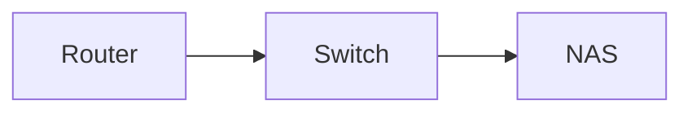

# The editor

The browser client is a Preact app around a CodeMirror 6 editor. A note
opens as its rendered view; the editor is a mode you step into and out
of. What follows is what the client does and which endpoints it leans
on.

## The shell

One component tree, three layouts, picked by width:

| Width | Layout |
|---|---|
| under 720px | Phone. One pane, no tab strip. The sidebar is a drawer; a bar along the bottom has Notes, Search, Today and New. A note reads or edits, never both; while editing, a formatting bar replaces the bottom bar. |
| 720 to 1023px | Tablet. The drawer stays; the top bar has room for New and Today. The tab strip sits above the note. Read, Edit and Split are all available. |
| 1024px and up | Desktop. The sidebar is a column that collapses from the top-left button; the tab strip sits above the note; Split puts the editor beside the render. |

The sidebar holds search (full text, or a regular expression with the `.*`
switch when the server has ripgrep), the tree, and the links to the tag
index, the unresolved-link report, the trash, and settings. Search
results replace the tree while a query is typed. A space you belong to
shows in the tree even before it holds a note, with the `+` to start one,
and so does a folder that holds no note yet.

Spaces and folders open and close from their row; the space header is
the toggle, with the note count beside the name. Folders start closed
and spaces open, and what was opened is remembered per browser
(`yana.tree.open` holds the folders opened, `yana.tree.closed` the
spaces closed, so an empty store is the default). Opening a note by any
way other than a click in the tree (search, a wikilink, the switcher,
the URL) opens its space and the folders above it and scrolls the row
into view; a click in the tree never reopens what was just closed. A
space's menu collapses or expands every folder in it, and the palette
does the same across the tree. A drag held over a closed folder or
space for a moment opens it.

Pinned notes and folders sit at the top of the tree, above the spaces.
A pinned folder is the folder, collapsible, with everything in it. Pins
are a preference of the browser (`yana.pins` in `localStorage`, beside
the recents), never a file in the tree: the tree is the folders and the
notes and nothing else. Pin from a note's overflow menu, the palette,
or the row's actions in the tree; the home page lists the pins too.

The home page is the three things people come here to do — New note,
Capture, Today — then the pins and the recently opened notes. The
shortcuts are one palette entry (Keyboard shortcuts), not a panel on the
home page.

Light and dark themes follow the system unless picked in the account menu
(top right) or on the Appearance page in settings, which also sets the
text size (small, normal, large), the line width (narrow, normal, wide),
the mode notes open in, the hide-syntax switch, and the sidebar density.
Those, the sidebar state, what the tree has open, the open tabs, the display name, the default spaces and the
recently opened notes are kept per browser in `localStorage` under
`yana.*`; nothing else is stored there. Everything in `prefs.ts` reads
the same keys, so a preference set in settings is what the shell and the
editor use after a reload, and while the page is open.

## Tabs

On a tablet or a desktop, notes open in tabs along the top of the
content pane. A phone has no strip: it shows one note, and the drawer
and the bottom bar do the switching.

- **Preview.** A click in the tree, a search hit, a recent note or a
  wikilink opens the note in the preview tab (its title in italics),
  replacing whatever the preview tab showed. Editing the note,
  double-clicking the tab, or Keep open on its menu makes it a normal
  tab. There is at most one preview tab, so browsing does not pile up
  tabs.
- **New tabs.** `Mod`-click or middle-click on a tree row, a search hit,
  a backlink, a task, an activity entry, a recent note or a wikilink
  opens it in a new tab behind the current one. Open in new tab is on
  the tree's note menu and on a wikilink's right-click menu. New notes
  and the daily note open in a new tab of their own.
- **The menu.** Right-click a tab, or hold it on a touch screen: Close,
  Close others, Close to the right, Keep open, Pin tab. Pinned tabs sit
  leftmost, show only an icon, and do not close with the close key. Tabs
  drag to reorder, and a note dragged from the tree onto the strip opens
  where it lands. A middle-click closes a tab.
- **The address.** The URL is always the active tab's note, so links,
  refresh and back and forward keep working; back and forward move
  through the notes a tab showed. Tasks, tags, activity, settings and
  the trash are pages, not tabs: they show in place of the active tab,
  and picking a tab brings it back.
- **One editor.** Only the active tab's note is mounted and holds a
  realtime session; the others are records (note, mode, scroll position,
  preview, pinned). Switching remounts the note, reconnects its session,
  and puts it back in the mode and at the scroll position it was left
  in. The tabs, their order and the active one are kept per browser
  (`yana.tabs`); on load the note in the URL becomes the active tab.
- **Gone notes.** A tab whose note was deleted, moved to the trash or
  left in a space the account lost greys its title, and closes with a
  message when picked. A renamed note's tab follows the tree.

## Settings

`/settings` — from the account menu, the palette, or the sidebar — is a
column of sections beside the page on a desktop and a list that opens
one section at a time on a phone:

- **Account** — the display name shown beside your cursor (and, on a
  server without accounts, the author of your edits), a password change,
  and every device signed in with sign-out for one or all others.
- **People** (owner only) — the accounts: add, remove, reset a password.
- **Spaces and sharing** — create, rename and remove spaces; each space's
  members and roles for its owners, your own role otherwise; the space
  new notes and the daily note go into.
- **Agents** (owner only) — keys for the MCP endpoint, with the URL and
  a copy button. See [agents.md](agents.md).
- **Appearance** — the preferences above.
- **Data** — exports, the trash and its retention, git history with
  Snapshot now, and the index: state, last scan, counts, ripgrep
  availability and version, the server version.

A page an account cannot use says what it is for and who can. A viewer
in a space sees its notes without the pencil, the title edit or the
delete action; the toolbar shows a Viewer badge instead.

## New note

New — the button, `Alt+T` (or `Alt+N`), the `+` on a space, "New note here" on a
folder — never asks for a path. It creates `Untitled.md` (then
`Untitled 2.md`, and so on) beside the open note, or at the top of the
default space, opens it in the editor with the title selected, and
waits. Type the title and press Enter: the heading is written, the file
is renamed to match, and the caret lands in the body. A note left
untitled stays `Untitled.md`, which is what it is.

The title is also where the note goes. A slash in it places the note:
`projects/kiln` moves it into `projects/` beside where it was (the folder
is made if it is not there) and calls it kiln; `/work/plan` starts from
the root, so it can change space; `../kiln` steps up a folder; `archive/`
with nothing after the slash moves the note and keeps its name. While
you type, a line under the title says where the note will land and
marks a folder that does not exist yet. The heading in the body only
ever gets the name, never the path.

The crumbs above the title are a button: the folder the note is in, and
a click opens "Move to a folder". The input holds the note's current
folder path, to edit by hand or leave alone; under it is every folder,
indented as in the tree, with the current one marked. Pick one with the
arrows, a click or a tap, or edit the path: the list narrows to the
folders under what is typed, and a path that is not there yet is made on
Enter. A bare name like `archive` lands inside the note's own space;
`work/archive` names the space. The same picker moves folders. The path
in the Details panel is a button too, for "Rename or move by path", the
same move with the file name included. On a desktop a note also drags to
a folder in the tree.

The path prompt survives for people who want it: "New note at a path" in
the palette takes a name or a path like `projects/kiln`, and the quick
switcher still creates the note you typed when nothing matches.

## Capture

Capture — the button on the home page, in the phone's bottom bar and the
top bar elsewhere, `Alt+C`, or the palette — takes one line and appends
it to the end of today's daily note without opening it. The line lands
as `- text` through the note's CRDT document (`POST /api/notes/daily`
for the note, then a short realtime session to write the line), so a
client with the note open sees it arrive. The toast that follows has
Undo, which takes the line out again wherever it now sits. Offline, the
line queues in the outbox and lands when the connection returns. The
share target ([pwa.md](pwa.md)) uses the same code path.

## Tags

A `#tag` in a note body is a tag: letters, digits, `_`, `/` and `-`,
after a space, a `(` or the start of a line, not a plain number, not in
code. The renderer marks each one (`<span class="tag" data-tag="…">`)
and the client makes it a link to the tag's page; the note's tags also
sit as chips under the title. `/tags` lists every tag with a count
across the spaces you can see (`GET /api/tags`); `/tags/<tag>` lists
every note carrying one (`GET /api/tags/{tag}`). The quick switcher
matches on tags too: type `#kiln` and the notes tagged kiln come up.
Tags are not folders and do not move anything; a note's folder is where
its file is.

## Tree actions

Every row in the tree has actions: right-click, or the `⋯` that shows on
hover, on a desktop; hold the row on a phone, which opens a sheet with
the row's name and path at the top. A note has Open, Pin, Move to a
folder, Rename or move by path, and Delete. A folder has New note here,
New folder inside, Pin, Rename, Move to a folder, and Delete. A space
heading has New note here and New folder, and carries both as buttons.

New folder and Rename happen in the tree: an input row where the folder
is, or the folder's own name turned into one. Enter keeps it, Escape
drops it, and a click elsewhere keeps it too. A double-click on a folder
renames it; a double-click on a note opens it with the title selected,
which is how a note is renamed from the tree. On a phone, where there is
no double-click and the sidebar is a drawer, the same actions ask in a
prompt instead.

Folders are real directories, so the actions are file operations:

- **New folder** is `POST /api/dirs` `{path}`, a `mkdir`. The tree lists
  empty directories, so the folder is there at once, with "New note
  here" under it.
- **Rename** and **Move** go through `POST /api/dirs/move` `{path, to}`,
  which moves every note under the folder through the same reconciler
  path a single note takes (`docs/links.md`), so every inbound wikilink
  is rewritten; then whatever else the directory held — `_assets/`, files
  the scanner ignores — follows, and the empty shell is removed. The
  toast reports how many notes moved and how many links were rewritten.
  A folder can also be dragged onto another folder or a space heading.
- **Delete** is `DELETE /api/dirs?path=…`: every note under the folder
  goes to the trash the way a single delete does, and the directories
  left empty are removed. Assets stay (a restored note may need them),
  so a folder holding some keeps its shell.

## Search on a phone

On a phone, Search in the bottom bar (or `/`) opens a page of its own:
the box at the top with the keyboard up, the queries typed before it
underneath until something is typed, results after that. Recent queries
are kept per browser (`yana.queries`, the last eight). A result opens
the note in read mode with the matched text scrolled into view and
marked; the mark stays while reading and clears on entering the editor.
Wider screens keep search in the sidebar and open results the same way.

## Title

The heading at the top of a note is its title and is edited in place.
Committing a new title (Enter, or clicking away) rewrites the note's first
`# ` heading through the CRDT — so it reaches every open client like any
other edit — and renames the file to match, dropping only the characters
a path cannot hold. The rename goes through `POST /api/notes/{id}/move`,
so wikilinks follow. A note whose title comes from its file name (no
heading) is only renamed. Escape puts the old title back.

Path, dates and size live in the Details drawer beside the note, with the
backlinks and the history; the tags sit under the title.

## Read, edit, split

A note opens in read mode: the rendered document, the same HTML the
server produces everywhere else. Wikilinks open the note they point at
(or offer to create it), images load from `_assets/`, footnotes jump.
Task boxes are live: ticking one rewrites its `[ ]` or `[x]` through the
CRDT, so the change shows on every open client and reaches the file on
the next writeback, like any other edit. The renderer stamps each box
with the source line its marker sits on (`data-line`, counted from the
start of the body after any frontmatter); the client checks that line
still holds a marker in the expected state before writing, and re-renders
instead if the text has moved underneath.

Edit is the source editor. Get there with the pencil, by pressing `e`, or
on a desktop by clicking the body of the note anywhere that is not a link
or a box (a drag to select text does not count). Escape, or Done on a
phone, goes back to reading. Split shows the editor and the render side
by side and is for screens 720px and wider; `Mod+E` toggles it.

The mode a note opens in — read, edit, or split — is a preference in the
account menu, the palette and settings. A note you just created always opens in
the editor with the caret ready. A phone never opens in split; it reads.

Presence chips in the toolbar list the other people who have the note
open, one chip per person, in any mode. Your own account in another tab
is not listed.

### On a phone

While editing, a bar of formatting buttons sits above the keyboard:
bold, italic, heading (cycles `#`, `##`, `###`, none), list, task,
quote, code (inline, or a fence around a multi-line selection), link,
Attach, undo and redo. Attach opens the photo picker, the camera, or the
file browser, and uploads through the same `_assets/` path as drag and
drop. The buttons take no focus, so the keyboard stays up.

The shell sizes itself to the visual viewport while the keyboard is
open, so the caret and the bar stay above it. Lines wrap, long words
break, and nothing scrolls sideways; tables and code blocks scroll
inside themselves in the render. Autocorrect is off in the editor on a
phone (it rewrites paths, code and link targets); spellcheck and
sentence capitalisation stay on.

### Hide the syntax

An optional switch, off by default, collapses markdown marks on the
lines the caret is not on: `#` before headings, `**` and `_` around
emphasis, backticks around inline code, `~~`, and the brackets and
target of an inline link, so `[text](url)` reads as `text`. Move the
caret onto a line and its marks come back. Block marks (list bullets,
quotes, fences) and wikilinks are always shown. It is in the account
menu as "Hide syntax while editing".

## Editing

Each note's text is a Yjs document bound to the editor through
`y-codemirror.next`. Keystrokes become CRDT updates, batched on a 50 ms
timer and sent over the relay (`docs/realtime.md`); updates from other
clients and from the filesystem arrive the same way and splice into the
editor without touching the local caret.

Undo is scoped to the local client. The undo manager tracks only
transactions whose origin is the local binding; remote updates carry the
origin `remote` and are never on the stack. Undo in one tab does not revert
text typed in another, which the Phase 0 harness verified for the library
and the browser smoke test verifies for the app.

Presence comes from the awareness protocol: each client announces its
user (name, colour) and the editor binding publishes its cursor as a
relative position. Remote carets draw in the editor with the author's name;
the bar above the note lists who else is on it.

### Buttons and completion

The same formatting buttons the phone shows above its keyboard sit in
the toolbar on a desktop while editing (undo and redo are left to the
keyboard there): bold, italic, heading, list, task, quote, code, link,
Attach, tag. Each is a small command on the editor: wrap the selection,
toggle a line prefix, insert a mark. **Link** turns selected words into
`[[words]]`, a selected URL into `[](url)`, and with nothing selected
opens `[[` and the note list. **Tag** inserts `#` and the tags in use.

Typing `[[` offers the notes of the note's space (a link resolves inside
its space); picking one inserts its file name, or its path from the space
root when two notes share a file name, and closes the brackets. Typing
`#` at the start of a word offers the tags already in use. Escape closes
the list without leaving the editor; Mod-Space opens it by hand.

### The starter note

The owner's first sign-in seeds an empty tree with `Start here.md`, `A
linked note.md` and `_assets/yana.png`: ordinary files that show links
(one resolved, one not), a picture, tasks, tags, a table and a footnote
by using them, with a heading per feature saying how on a desktop and on
a phone. A tree that already holds a note is never seeded. Help lists
"how do I" entries that open the note at the matching heading, and
re-creates it in the default space when it is gone (`POST /api/guide`).

## Rendering

The read view and the split preview render the live document through
`POST /api/render` with the same goldmark pipeline the note endpoint
uses, so wikilinks, tags, code blocks, and images look the same
everywhere. The render that came with the note is shown first; the live
one replaces it once the session is up. Rendering runs at most every
220 ms while typing.

Three constructs go past plain markdown. The server marks each in the
HTML; the browser draws it, with a bundled copy of the library (no CDN,
so they work offline and in the exports).

**Diagrams.** A fence with the language `mermaid` renders as a diagram
(`internal/render/rich.go` emits it as `<pre class="mermaid">`; the
client swaps in the SVG). The diagram takes its colours from the app
theme, light or dark. One that fails to parse shows its source with a
one-line message.



**Callouts.** A blockquote whose first line is `[!kind]` renders as a
callout with an icon and a colour. The kinds are `note`, `tip`,
`warning`, `danger`, `info` and `question`; anything else is a plain
callout titled with the kind. Text after the kind is the title. A `-`
or `+` right after the closing bracket makes the callout foldable,
folded or open.

```md
> [!warning] Mind the gap
> The body is ordinary markdown.
```

**Math.** `$…$` inline and `$$…$$` on lines of their own render with
KaTeX. A dollar sign that is not math stays a dollar sign: inline math
must close on the same line, may not have whitespace directly inside its
delimiters, may not run into a digit after the closing one, and may not
cross a backtick. `$5 and $10`, `$HOME` and `` `$x$` `` are left alone.

```md
The area is $\pi r^2$.

$$
\int_0^1 x^2 \, dx = \frac{1}{3}
$$
```

The libraries are split from the main bundle and fetched the first time
a note needs one (`web/src/rich-load.ts`); the service worker precaches
them with the rest of `assets/`, so a diagram drawn once is drawn
offline too. The exports carry the same libraries as classic scripts
(`web/src/export-mermaid.ts`, `web/src/export-katex.ts`), copied beside
a static site's pages or inlined into a single-file export, fonts
included, only when a page uses them.

## Files: drag, drop, paste

Dropping a file onto the editor, pasting one from the clipboard, or picking
one from the Attach button (the phone's formatting bar, or the toolbar on a
desktop) uploads it to the note's sibling `_assets/` directory with `PUT
/api/files/<path>` and inserts `` at the drop point
for a picture, a plain `[name](_assets/name.ext)` link for anything else —
a PDF, a spreadsheet, a document. While the upload runs the document holds a
placeholder link, so other clients see something sensible; the server picks
a free name (`shot.png`, `shot-2.png`, …) rather than overwriting, and the
link uses the name it actually wrote. Uploads are bounded by
`YANA_MAX_ASSET_SIZE` and require write access to the space.

In the read view, a link into `_assets/` that is not a picture renders as a
card: name, size, and for a PDF its page count and a button that expands an
inline viewer on the content origin — sandboxed like an HTML note
([html-notes.md](html-notes.md)) — plus a download link. On a phone the
card opens the file in the system viewer instead. The scanner extracts a
PDF's text into search, so a phrase from inside a manual finds it; search
answers with attachments as their own kind alongside notes, each linking to
the note that uses the file and to the file itself. An asset no note
references shows up as unreferenced on the Data page, with a Trash button
that moves it to `.trash/` — never a delete.

Because an `` cannot send an `Authorization` header, `GET
/api/files/...` also accepts the access token as `?token=`, the same way
`/ws` does.

Dragging a note from the sidebar tree onto a directory, a space heading, or
another note moves it there. That is a `mv` on disk through
`POST /api/notes/{id}/move`, so wikilinks pointing at the note are
rewritten (`docs/links.md`); the toast reports how many. Dragging a
folder does the same for everything in it (`POST /api/dirs/move`).
Dragging a note into the editor inserts a wikilink to it.

## Hotkeys

`Mod` is Command on a Mac and Control elsewhere. Browser-reserved
combinations (`Mod+N`, `Mod+T`) are avoided because pages cannot
intercept them. The tab keys use the usual `Mod+W`, `Mod+Shift+T` and
`Ctrl+Tab`, which a browser tab keeps for itself but the installed app
receives; each has an `Alt` twin that works everywhere.

| Key | Does |
|---|---|
| `Alt+T` or `Alt+N` | New note, in a tab of its own: an untitled note with the title selected; Enter in the title moves to the body |
| `Alt+C` | Capture: one line onto the end of today's note, without opening it |
| `Alt+D` | Today's daily note (created on first use) |
| `Alt+K` | The tasks page |
| `Mod+P` | Quick switcher: fuzzy match on title, path and `#tag`; Enter on no match creates that note |
| `Mod+K` | Command palette: everything above plus new note at a path, new folder, pin, move, rename, delete, tags, unresolved links, trash, settings, theme, sign out |
| `Mod+Shift+F` or `/` | Focus search |
| `E` | Edit the open note |
| `Esc` | Back to reading |
| `Mod+E` | Editor and render side by side (on a phone: in and out of the editor) |
| `Ctrl+Tab` / `Ctrl+Shift+Tab`, or `Alt+]` / `Alt+[` | Next and previous tab, wrapping |
| `Alt+1` … `Alt+9`, or `Mod+1` … `Mod+9` | That tab; 9 is the last one |
| `Mod+W` or `Alt+W` | Close the active tab (a pinned one stays); with no tab open, the browser's own close |
| `Mod+Shift+T` or `Alt+Shift+T` | Reopen the tab closed last |
| `Mod+Z` / `Mod+Shift+Z` | Undo / redo (local edits only) |
| `Mod+F` | Find in the open note |
| `Esc` | Close whatever is open |

The switcher and the palette list every note in the tree and filter as you
type; arrows move, Enter picks. The switcher puts recently opened notes
first. The full list of shortcuts is one palette entry, also in the
account menu.

## Daily note

`Alt+D` (or the palette) opens today's note. The client sends its local
date to `POST /api/notes/daily` with the space to use — the daily-note
space from settings, else the open note's space, else the default space
from settings, else the first one in the tree — and the server answers
with the existing note or creates it.

Two settings shape it, both paths relative to the space:

| Setting | Default | Meaning |
|---|---|---|
| `YANA_DAILY_PATTERN` | `journal/{YYYY}/{MM}/{YYYY}-{MM}-{DD}.md` | Where the note lives |
| `YANA_DAILY_TEMPLATE` | `templates/daily.md` | A note whose body seeds a new daily note |

`{YYYY}`, `{MM}`, `{DD}` and `{date}` (`YYYY-MM-DD`) expand in both. When
the template note does not exist the new note starts as a heading with the
date. The template's own frontmatter is dropped; the daily note gets an id
of its own like any other file.

## Endpoints added for the editor

| Method and path | Purpose |
|---|---|
| `PUT /api/files/{path}` | Upload one file under an `_assets/` directory; body is the file, response carries the path written (and a PDF's page count once extracted) |
| `DELETE /api/files/{path}` | Move one asset to `.trash/` — never a delete |
| `GET /api/attachments/{path}` | One attachment's metadata: name, size, and a PDF's page count |
| `GET /api/assets/orphans` | Assets no note in their space references, for the Data page |
| `GET /api/notes/{id}/asset-view?asset=` | Mints the content-origin URL an attachment card's inline viewer loads |
| `POST /api/notes/daily` | `{space, date}` → today's note, created from the template if missing |
| `POST /api/guide` | `{space}` → the starter note in that space, written first when missing (`201`), found otherwise (`200`); editors and up |
| `POST /api/render` | `{markdown}` → `{html}` for the read view and the preview |
| `GET /api/tags` | Every tag with its note count, across the spaces the account can see |
| `GET /api/tags/{tag}` | Every note carrying one tag |
| `POST /api/dirs` | `{path}` → make an empty folder |
| `POST /api/dirs/move` | `{path, to}` → move every note under a folder (links rewritten), then the rest, then remove the shell |
| `DELETE /api/dirs?path=` | Trash every note under a folder and remove the directories left empty |

`GET /api/tree` lists empty directories as well as the notes, and each
note row carries its `tags`.

`GET /api/status` now includes `daily` with the effective pattern and
template.

## Building

`web/` builds with esbuild (`npm run build`) into `web/dist`, which the
binary embeds. Bundle names carry a content hash (`assets/app-XXXX.js`)
and `index.html` is rewritten to match, so the long immutable cache
lifetime the server puts on `/assets/` is safe across releases. The same
build copies the icons from `web/icons/`, writes `manifest.webmanifest`, and
fills `sw.template.js` into `sw.js` with the hashed names and a version
stamp — the installable-app side of the client
([pwa.md](pwa.md)). `npm run watch` skips the worker so development is
never shadowed by a cache.
