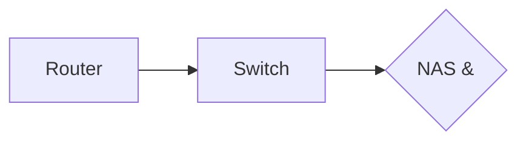

# Diagram


```mermaid
flowchart LR
  A[Router] --> B[Switch]
  B --> C{NAS & <server>}
```

A go fence is still highlighted:

```go
fmt.Println("x")
```

~~~mermaid
sequenceDiagram
  A->>B: hi
~~~

- In a list:

  ```mermaid
  graph TD; X-->Y
  ```
